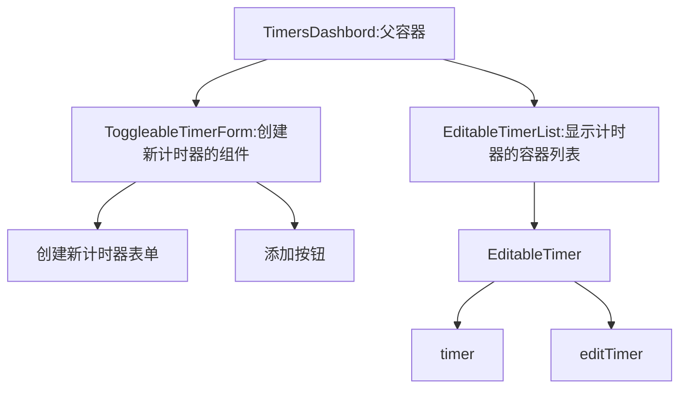

#Note

```mermaid
    graph
    father["TimersDashbord:父容器"]-->soon["EditableTimerList:显示计时器的容器列表"]
    father-->ToggleableTimerForm["ToggleableTimerForm:创建新计时器的组件"]
    ToggleableTimerForm-->创建新计时器表单
    ToggleableTimerForm-->添加按钮

    soon-->editorTimer["EditableTimer"]
    editorTimer-->timer
    editorTimer-->editTimer


```