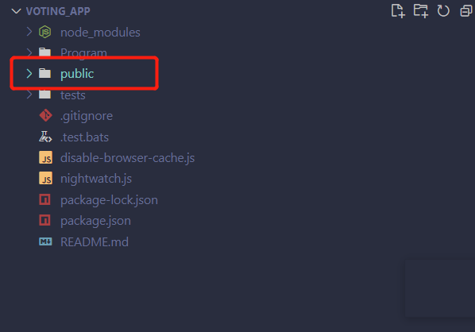
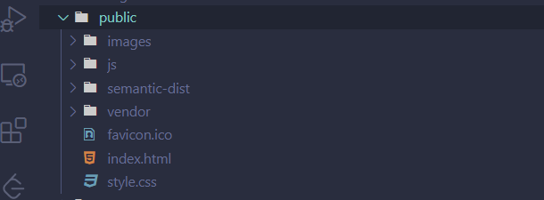
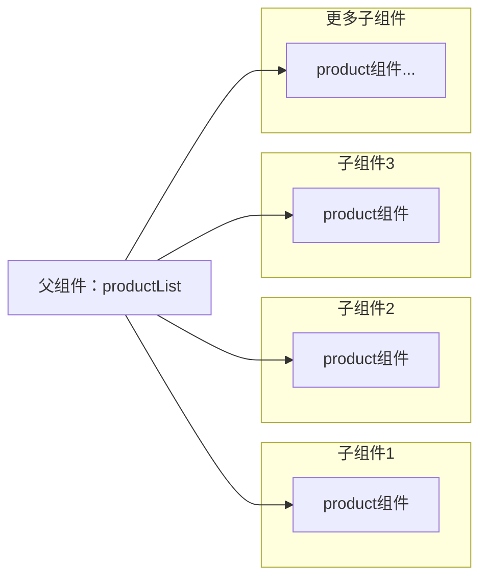
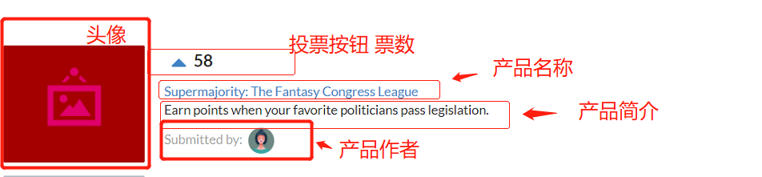

# 第一章 第一个React Web应用程序
## 1.1 构建ProductHunt项目
### 目标
构建一个简单的投票应用程序
(producthunt)[https://www.producthunt.com/?ref=header_nav]
## 1.2设置开发环境
### 1.2.1 
- 好用的IDE
   vscode Atom Sublime Text
- 下载Node和Npm 
  - mac最好是通过Nodejs官网安装 否则会带来一些问题
- git
- 浏览器
  - chrome
## 1.3 针对window用户的说明
    安装了IIS
## 1.4 JavascriptEs6 Es7 Es2016

## 1.5 开始
### 1.5.1实例代码
### 1.5.2应用程序预览
### 项目结构


#### 1. 文件结构分析：
1. index.html
 提供给服务器访问的首页文件，负责加载应用程序中的其他资源 
2. public/js 
   存放JavaScript位置
   app.js 编写React应用程序的地方
   app-complete.js是开发完成的app.js的完整版
#### 2. 技术栈
1. ui框架 Semantic ui
#### 2. 分析应用结构
1. 什么是组件 
   1. React应用程序的基础就是组件 单独的React组件视为一个UI组件 React的视图由组件组合构成
   2. 组件得有点：清晰得映射到对应得ui组件 并且组件是独立得 代码与视图逻辑以及css集中分布 可复用
   3. 如何保证了ui得一致性：组件得输入发生更显 框架会重新渲染该组件
2. React-创建组件
   1. 作为Es6类
   2. 导入并使用createReactClass方法
3. 项目组件分析：父组件多个子组件的结构
   1. ProductList组件 ：包含Product组件得列表
   2. Product组件:显示给定产品
#### 3.Babel
- 产生原因：大多数浏览器并不完全支持es6
- Babel是什么：Javascript转义器
  - 1. 转译：ES6转成ES5
  - 2. 理解JSX：JSX转成原生js vanillaJs
    ```mermaid
    graph LR
    Babel-->Z["转义：es6转es5"]
    Babel-->L["理解JSX：JSX转成vanilla(原生js) ES5 JS"]
    ```

#### 4.代码编写流程

  ```mermaid
    graph LR
    app.js-->编写
    编写-->APPJS-->定义父组件["APP.JS内定义父组件"]
           APPJS-->渲染组件到指定Dom元素
    编写 -->INDEX.HTML-->js库["引入js库"]
            INDEX.HTML-->引入BabelJS
            INDEX.HTML-->定义Dom元素
            js库-->React
              React-->JS
              React-->ReactDom
  ```
#### 构建组件子组件Product
props与html元素交织在一起 创建动态数据驱动React组件
1. 类组件定义 子组件
   1. 分析：
   2. 
2. props 数据流
      1. React数据自父组件流向子组件
         1. 如何实现：props
            1. 父组件渲染子组件 可以给子组件发送其依赖props
      2. 获取数据流
         1. 子组件 this.props
3. JSX
   1. {} 大括号是一个分隔符 
      1. 它告诉jsx大括号里的内容是Javascript表达式
   2. '' 引号 表示字符串
   3. JSX属性值必须由大括号或者引号分割
4. React key
   1. key 属性为组件的每一个实例创建唯一绑定 key是React框架里的唯一标识
5. React-事件传递
   1. 将函数作为props传递 由父组件向下传递 父组件为每一个子组件提供一个函数
   2. this 绑定到自定义组件的方法
      1. 特殊的this根据上下文具有不同的绑定
         1. render  的this 绑定 当前组件 React自动会把this 绑定到当前组件
         2. 能够把this自动绑定到当前组件的React方法 
            1. componentDidMount
            2. render 
      2. 自定义组件的方法 需要手动讲this绑定子的组件
         1. constructor()函数添加到Product组件顶部
            ```
               constructor(props){
                  this.componentFunction  = this.this.componentFunction.bind(this)
               }
            ```
      3. constructor解析
         1. 通过类创建对象的时候 constructor() 就会被调用
         2. React在初始化组件的时候 首先调用 constructor()
         3. 在定义React类组件的方法的时候 必须在constructor()函数中执行绑定模式

           

  
6. 使用State
   1. props:
      1. props是不可变的 父组件是拥有者
   2. state
      1. state是组件私有的 this.setState 进行更改
   3. 组件的state或者props更新组件会重新渲染
      1. 数组是需要与状态的 并且是可以更改的 因为需要把普通数据转化成 state的形式
      2. 我们要是认为state为不变的 就是不要带来副作用 
      3. 避免改变对象
         1. Object.assign
      
7. Babel插件 transform-class-properties(属性初始化器)
   1. 需要在了解一下
      1. 类中的静态方法并不能被 实例访问 有了这个插件实例就可以访问了
   2. 能看明白的：
      1. 在constructor外定义初始状态
## QAQ
1. script 标签 type=text/babel 未加报错
   ```
    <script src="./js/app.js"></script>
   ```
   ```
    <script type="text/babel" src="./js/app.js"></script>
   ```
   
   1. 原因：Js引擎解析代码遇到不符合语言语法的语法就是 js引擎并不认JSX语法


