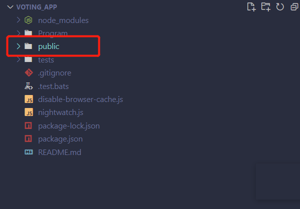
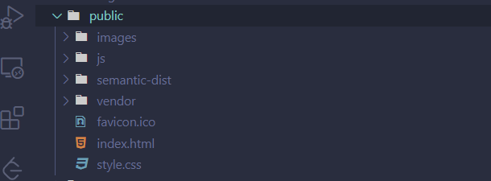
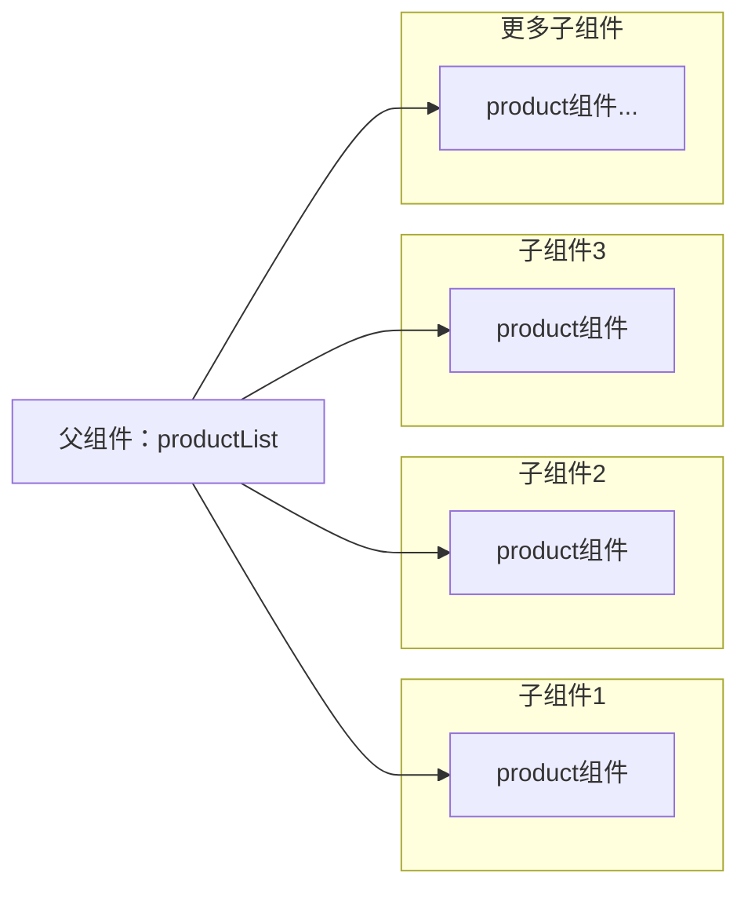

# 第一章 第一个React Web应用程序
## 1.1 构建ProductHunt项目
### 目标
构建一个简单的投票应用程序
(producthunt)[https://www.producthunt.com/?ref=header_nav]
## 1.2设置开发环境
### 1.2.1 
- 好用的IDE
   vscode Atom Sublime Text
- 下载Node和Npm 
  - mac最好是通过Nodejs官网安装 否则会带来一些问题
- git
- 浏览器
  - chrome
## 1.3 针对window用户的说明
    安装了IIS
## 1.4 JavascriptEs6 Es7 Es2016

## 1.5 开始
### 1.5.1实例代码
### 应用程序预览
### 项目结构

#### 1. 文件结构分析：
1. index.html
 提供给服务器访问的首页文件，负责加载应用程序中的其他资源 
2. public/js 
   存放JavaScript位置
   app.js 编写React应用程序的地方
   app-complete.js是开发完成的app.js的完整版
#### 技术栈
1. ui框架 Semantic ui
#### 2. 分析应用结构
1. 什么是组件 
   1. React应用程序的基础就是组件 单独的React组件视为一个UI组件 React的视图由组件组合构成
   2. 组件得有点：清晰得映射到对应得ui组件 并且组件是独立得 代码与视图逻辑以及css集中分布 可复用
   3. 如何保证了ui得一致性：组件得输入发生更显 框架会重新渲染该组件
2. React-创建组件
   1. 作为Es6类
   2. 导入并使用createReactClass方法
3. 项目组件分析：父组件多个子组件的结构

  1. ProductList组件 ：包含Product组件得列表
  2. Product组件:显示给定产品
## QAQ
1. script 标签 type=text/babel 未加报错
   1. 原因：Js引擎解析代码遇到不符合语言语法的语法就是 js引擎并不认识这些代码
