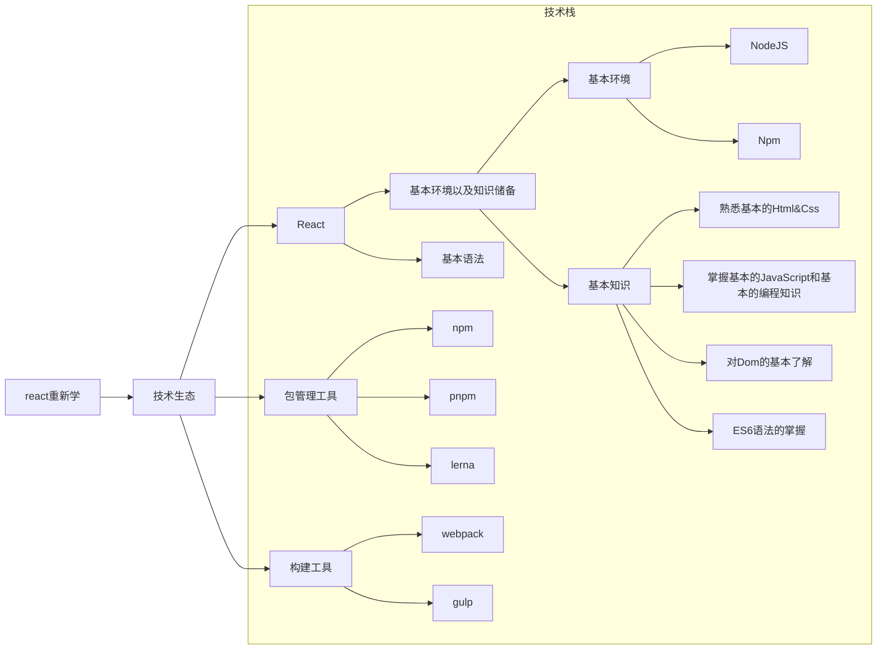
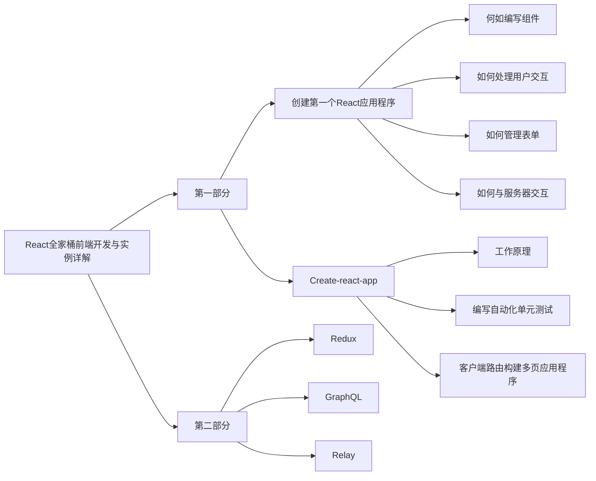

## react是什么
React已经是一个普通的js库 也不是一个框架儿而是一个庞大的体系 如果我们把react应用到实际开发中真个技术栈都需要围绕react进行开发改造需要学习一整套的解决方案 前端到后端都是全新的做法

## 我的计划
React18 即将到来 React自16.8版本后使用方式发生了翻天覆地的变化
重学React对于我来说已经变得重要且紧急。我的工作环境脱离实战，我无法从项目中更快更好的掌握它，如果看官方教程也只是零散不够系统得。因此我挑了一本书《React全家桶前端开发与实例详解》作为一个点 在过程中不端得补充学习 希望可以得到一个好的结果。
全书共1225页
